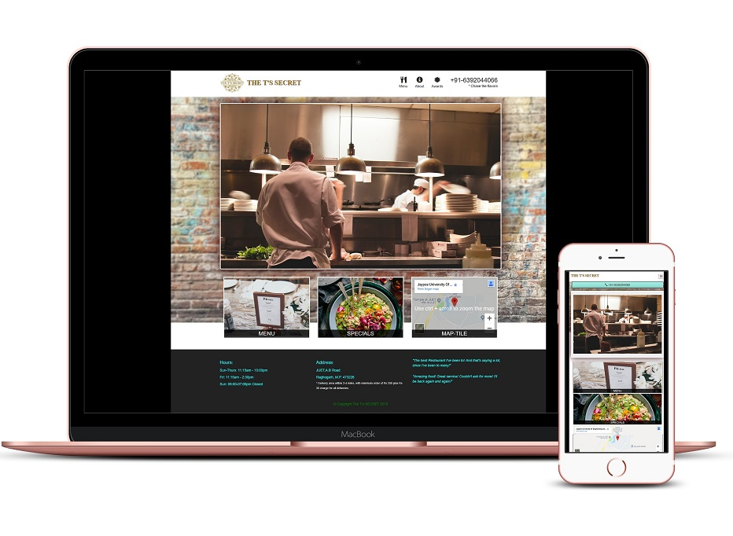
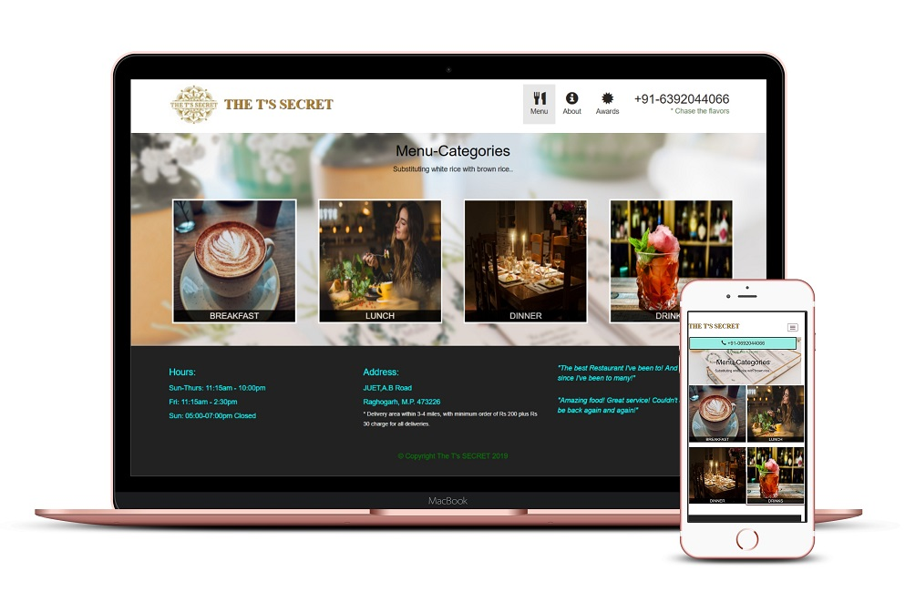
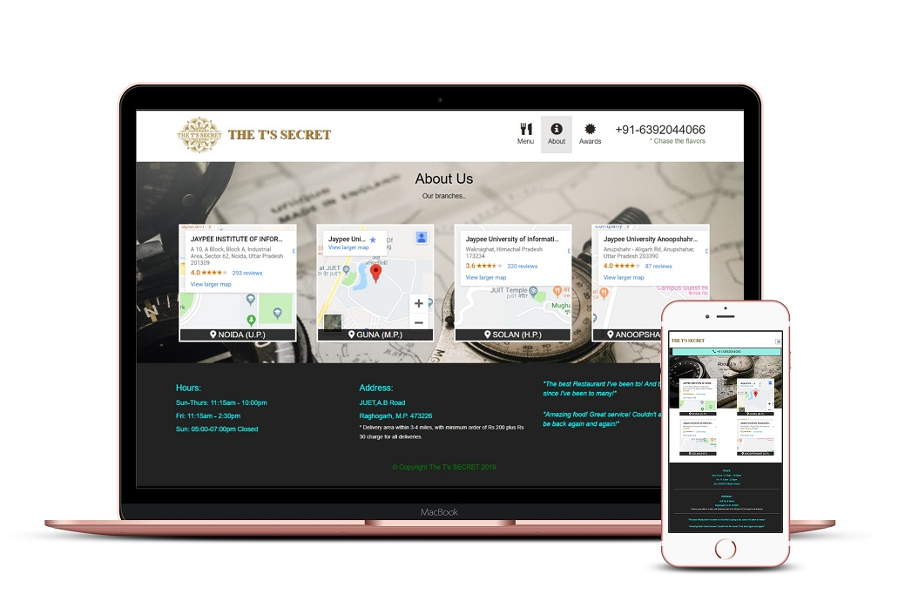
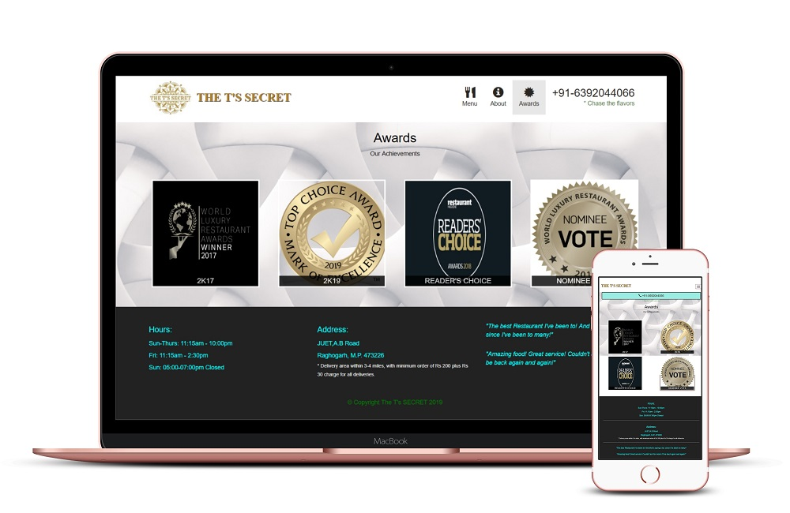
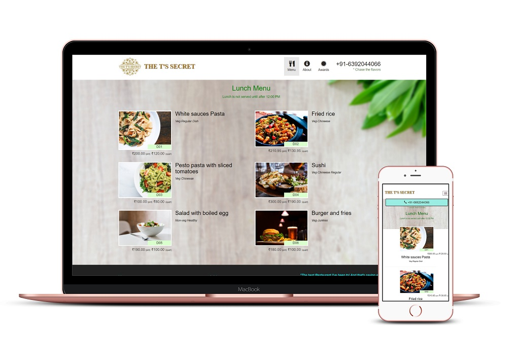

The link for this project is-https://tripathi2212.github.io/Restaurant-Website-Fully-Responsive-/

Restaurant Management Website fully responsive in any frame.This restaurant website is designed on HTML5, CSS3 and Bootstrap 3 framework, which makes this website load faster and mobile responsive. With bright colors and popular Google fonts, this website looks professional and modern. Responsive navbar and google map perfectly add up to make the website neat.
Learning from this website is to make application responsive and user-friendly.

   **Home**

   **Menu**

   **About Us**

   **Awards**

   **Inside Menu**

